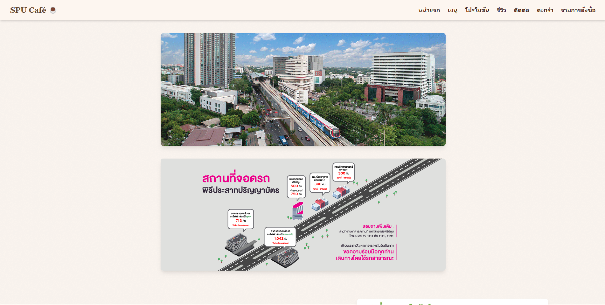
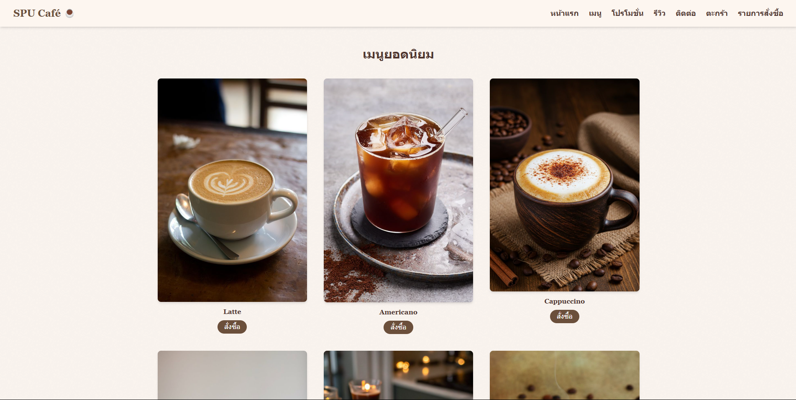
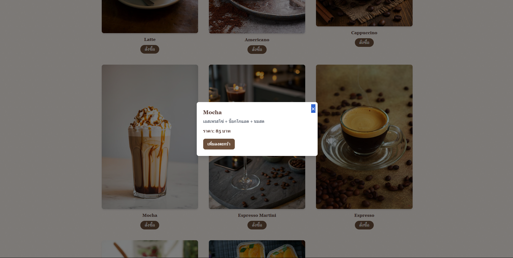
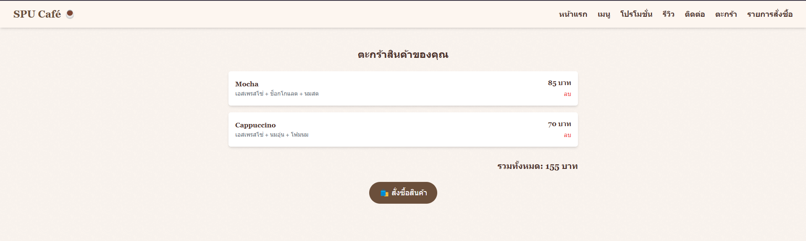

## 12367
### โปรเจค ร้านขายกาแฟ 

## คำอธิบาย

[โปรเจ็คร้านกาแฟนี้สร้างขึ้นมาเพื่อจัดทำการขายกาแฟของมหาวิทยาลัยศรีปทุม]

## วิธีการใช้งาน

1. เปิดโปรแกรมด้วยคำสั่ง python manage.py runserver
2. คลิกที่ปุ่ม (http://127.0.0.1:8000/)

## ตัวอย่าง

